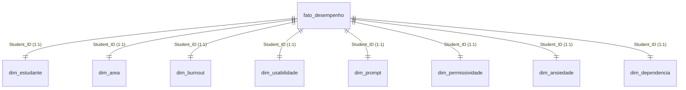

# Dashboard de Impacto da Inteligência Artificial no Desempenho e Bem-Estar Estudantil

Este repositório contém a estrutura de modelagem e relatórios do projeto de Business Intelligence II, voltado à análise do impacto de ferramentas de Inteligência Artificial Generativa no cotidiano e na saúde mental de estudantes universitários. O projeto está estruturado no formato nativo do Power BI Project (`.pbip`), viabilizando o controle de versão e a governança de dados como código.

---

## 1. Visão Geral do Projeto

*   **Propósito de Negócio:** O dashboard visa fornecer aos gestores educacionais, coordenadores de curso e profissionais de apoio pedagógico insights quantitativos e qualitativos sobre a relação entre o uso de IA Generativa, o desempenho acadêmico (GPA) e indicadores de saúde mental (como níveis de ansiedade e risco de burnout). O objetivo é apoiar a elaboração de políticas institucionais baseadas em evidências para o uso ético da IA e suporte psicopedagógico direcionado.
*   **Fontes de Dados:** O modelo semântico é alimentado a partir do dataset estruturado `ai_student_impact_dataset (1).csv`, que contém variáveis acadêmicas, demográficas e de bem-estar de estudantes universitários.

---

## 2. Alinhamento Estratégico (Matriz de OKRs)

Abaixo é apresentada a matriz de alinhamento entre os objetivos estratégicos da instituição de ensino e os indicadores mensuráveis fornecidos pelo dashboard:

| Objetivo Estratégico (Business Objective) | Indicador Chave (Key Result) | Medida DAX Associada |
| :--- | :--- | :--- |
| **Mitigar o desgaste e estafa mental dos estudantes** | Identificar e apoiar discentes com alto nível de exaustão, reduzindo o volume absoluto de risco crítico | `[Burnout alto]` |
| **Monitorar o estresse psicológico em avaliações** | Controlar a média de estresse declarada, acionando suporte quando ultrapassar níveis recomendados | `[Media Ansiedade]` |
| **Acompanhar a dependência de tecnologias emergentes** | Garantir que o suporte a ferramentas de IA não atinja níveis críticos de dependência autodeclarada | `[Media Dependencia]` |
| **Avaliar o impacto de políticas institucionais restritivas** | Monitorar a variação dos níveis de ansiedade entre instituições com diferentes políticas de uso de IA | `[Delta Ansiedade Política]` |
| **Garantir a representatividade amostral por área** | Assegurar o mapeamento equilibrado de estudantes em todos os departamentos cadastrados | `[Total de Areas]` |

### 📊 KPIs de Referência Organizacional
Para fins de vinculação e avaliação de desempenho corporativo e acadêmico, são definidos os seguintes KPIs com base nos dados do dashboard:
*   **`KPI_Ansiedade_Media`**: Média geral do nível de ansiedade dos estudantes durante os exames (Score de 1 a 10).
*   **`KPI_Burnout_Critico`**: Quantidade total de estudantes classificados sob risco "high" de burnout.
*   **`KPI_Maturidade_IA`**: Percentual de estudantes avaliados com nível intermediário ou avançado em Prompt Engineering.
*   **`KPI_Dependencia_Geral`**: Score médio da percepção discente de dependência de IA Generativa.

### 🎯 OKRs de Negócio Detalhados

#### Objetivo 1 (Saúde Mental e Clima Acadêmico)
> **Garantir a integridade psicossocial dos estudantes através de ambientes de avaliação equilibrados e políticas ativas de mitigação de estresse e estafa mental.**
*   **KR 1.1:** Reduzir a média de ansiedade geral dos estudantes durante os exames de 6.5 para menos de 4.0 pontos até 30 de junho de 2026.
    *   *KPI Vinculado:* `KPI_Ansiedade_Media`
*   **KR 1.2:** Diminuir em 25% a taxa de estudantes em risco crítico de burnout por meio de programas ativos de acolhimento psicopedagógico até 15 de maio de 2026.
    *   *KPI Vinculado:* `KPI_Burnout_Critico`
*   **KR 1.3:** Reduzir em 40% a diferença de ansiedade observada entre instituições que restringem a IA e as que a incentivam até o final do Q2 de 2026.
    *   *KPI Vinculado:* `KPI_Ansiedade_Media`

#### Objetivo 2 (Maturidade Tecnológica e Autonomia Cognitiva)
> **Capacitar os estudantes para o uso autônomo, crítico e de alta performance de Inteligência Artificial Generativa, minimizando o risco de dependência intelectual.**
*   **KR 2.1:** Elevar de 30% para 65% a proporção de alunos com maturidade técnica avançada em Prompt Engineering até 31 de julho de 2026.
    *   *KPI Vinculado:* `KPI_Maturidade_IA`
*   **KR 2.2:** Reduzir a percepção média de dependência discente de ferramentas de IA Generativa de um score de 7.5 para no máximo 4.5 até 31 de julho de 2026.
    *   *KPI Vinculado:* `KPI_Dependencia_Geral`
*   **KR 2.3:** Reduzir em 30% a dependência de IA de alunos iniciantes (`Dependência Média Iniciantes`) até o final do primeiro semestre de 2026, por meio de workshops institucionais obrigatórios de literacia digital.
    *   *KPI Vinculado:* `KPI_Dependencia_Geral` e `KPI_Maturidade_IA`

---

## 3. Arquitetura do Modelo Semântico

### Arquitetura de Dados (Star Schema / Hub-and-Spoke)
O modelo semântico é estruturado em um formato lógico de **Esquema Estrela (Star Schema)**. A tabela central de fatos conecta-se às tabelas de dimensão usando relacionamentos baseados na chave de identificação única `Student_ID`. Para manter a otimização de processamento no Power BI, a tabela de origem foi normalizada em dimensões específicas por domínio de dados.



*   **Principais Tabelas Fato:**
    *   `fato_desempenho`: Tabela central que consolida as chaves lógicas de relacionamento e os atributos primários de desempenho acadêmico, nível de habilidade técnica e índices de estresse.
*   **Principais Tabelas Dimensão:**
    *   `dim_estudante`: Tabela de identificação e cadastro primário de cada estudante.
    *   `dim_area`: Associa os estudantes às suas respectivas áreas e categorias de estudo (`Major_Category`).
    *   `dim_burnout`: Classifica o nível de risco de estafa mental do estudante (`Burnout_Risk_Level`).
    *   `dim_usabilidade`: Mapeia o caso de uso prioritário do discente com as ferramentas de IA (`Primary_Use_Case`).
    *   `dim_prompt`: Identifica o nível autodeclarado de habilidade em Prompt Engineering (`Prompt_Engineering_Skill`).
    *   `dim_permissividade`: Descreve a diretriz institucional sobre o uso de IA na universidade (`Institutional_Policy`).
    *   `dim_ansiedade`: Detalha o nível de ansiedade nos exames e gera a classificação categórica customizada (`Personalizar`).
    *   `dim_dependencia`: Detalha o nível de dependência autodeclarada da IA e gera a classificação categórica (`Categoria_dependencia`).

### Segurança de Nível de Linha (RLS - Row-Level Security)
Para garantir a privacidade e restrição no consumo de informações estratégicas por área de atuação, foram implementados **6 papéis de segurança** no modelo semântico. Eles restringem dinamicamente a visualização das linhas com base no perfil do usuário logado:

*   **`Adm`**: Acesso completo e irrestrito. Permite visualizar e auditar todos os dados de todas as áreas de estudo de maneira consolidada.
*   **`Arts`**: Filtro lógico aplicado na dimensão de área (`dim_area`). Permite apenas a visualização de estudantes vinculados à área de Artes.
    ```dax
    [Major_Category] == "Arts"
    ```
*   **`Business`**: Restringe a visualização unicamente aos dados de estudantes vinculados à área de Negócios e Administração.
    ```dax
    [Major_Category] == "Business"
    ```
*   **`Humanities`**: Restringe o acesso exclusivamente a estudantes da área de Ciências Humanas.
    ```dax
    [Major_Category] == "Humanities"
    ```
*   **`Medical`**: Restringe o acesso unicamente a estudantes do curso e áreas de Medicina e Ciências da Saúde.
    ```dax
    [Major_Category] == "Medical"
    ```
*   **`STEM`**: Restringe o acesso aos dados de estudantes das áreas de Ciências, Tecnologia, Engenharia e Matemática (STEM).
    ```dax
    [Major_Category] == "STEM"
    ```

---

## 4. Dicionário das Principais Medidas DAX

Abaixo estão detalhadas as medidas DAX de negócios e governança mais críticas criadas para o dashboard:

### 4.1 Total de Alunos
```dax
Total Alunos = COUNTROWS(dim_estudante)
```
*   **Impacto de Negócio:** Fornece a contagem volumétrica exata de discentes monitorados no universo de dados, servindo de base populacional para cálculos de incidência e representatividade estatística.

### 4.2 Média de Ansiedade
```dax
Media Ansiedade = AVERAGE(dim_ansiedade[Anxiety_Level_During_Exams])
```
*   **Impacto de Negócio:** Monitora a saúde mental geral da amostra de discentes em períodos avaliativos. Permite identificar de forma proativa se o corpo discente está operando sob níveis de estresse não saudáveis.

### 4.3 Média de Dependência Percebida da IA
```dax
Media Dependencia = AVERAGE(dim_dependencia[Perceived_AI_Dependency])
```
*   **Impacto de Negócio:** Indica se o uso de ferramentas de IA Generativa está gerando um impacto negativo na autonomia intelectual dos alunos (terceirização do aprendizado), ajudando a traçar planos de capacitação metodológica.

### 4.4 Risco de Burnout Elevado
```dax
Burnout alto = COUNTROWS(FILTER(dim_burnout, dim_burnout[Burnout_Risk_Level]= "high" ))
```
*   **Impacto de Negócio:** Mapeia a quantidade absoluta de alunos que se encontram no limiar crítico de esgotamento físico e mental. Esta medida serve como indicador de urgência para disparo de políticas públicas e intervenções diretas de acolhimento.

### 4.5 Impacto de Políticas de Restrição na Ansiedade
```dax
Delta Ansiedade Política = 
CALCULATE(
    AVERAGE('fato_desempenho'[Anxiety_Level_During_Exams]),
    'dim_permissividade'[Institutional_Policy] = "Strict_Ban"
)
-
CALCULATE(
    AVERAGE('fato_desempenho'[Anxiety_Level_During_Exams]),
    'dim_permissividade'[Institutional_Policy] = "Actively_Encouraged"
)
```
*   **Impacto de Negócio:** Mede cientificamente a variação dos níveis de estresse e ansiedade associada à postura política da universidade frente à IA. Uma diferença acentuada indica o impacto psicossocial de políticas proibitivas ("Strict Ban") versus políticas colaborativas ("Actively Encouraged").

### 4.6 Dependência de Iniciantes em Engenharia de Prompt
```dax
Dependência Média Iniciantes = 
CALCULATE(
    AVERAGE('dim_dependencia'[Perceived_AI_Dependency]),
    'dim_prompt'[Prompt_Engineering_Skill] = "Beginner"
)
```
*   **Impacto de Negócio:** Determina se a falta de instrução formal de uso de IA (nível iniciante de prompts) leva a uma dependência cega e menos crítica das ferramentas. Auxilia no direcionamento de investimentos para cursos práticos de engenharia de prompt.

---

## 5. Instruções de Governança e CI/CD

### Abertura e Execução do Projeto
1. Certifique-se de que a versão do **Power BI Desktop** instalada em sua máquina local é compatível com suporte a Developer Mode (versões posteriores a meados de 2023).
2. Localize o arquivo `Estudantes_IA.pbip` na raiz deste repositório e dê um clique duplo para executá-lo.
3. O Power BI Desktop inicializará as definições lógicas contidas na pasta `.SemanticModel` e o layout visual na pasta `.Report`.

### Melhores Práticas de Controle de Versão (Git e CI/CD)
*   **Não Comitar Dados Locais Sensíveis:** Certifique-se de que o arquivo `.gitignore` esteja cobrindo pastas temporárias de cache de usuário e arquivos de configuração sensíveis.
*   **Gitignore Padrão para Power BI Developer Mode:**
    ```gitignore
    # Cache do Power BI Desktop
    **/__cache__
    **/.pbi
    **/.platform
    
    # Arquivos temporários e backups locais
    *.tmp
    *.backup
    
    # Arquivos temporários de usuário e layout dinâmico local
    **/User.zip
    **/diagramLayout.json
    ```
*   **Modificações Concorrentes:** Toda alteração estrutural no modelo semântico deve ser feita preferencialmente por ramificações (branches) dedicadas, mantendo o arquivo `model.bim` de produção estável e documentado.
